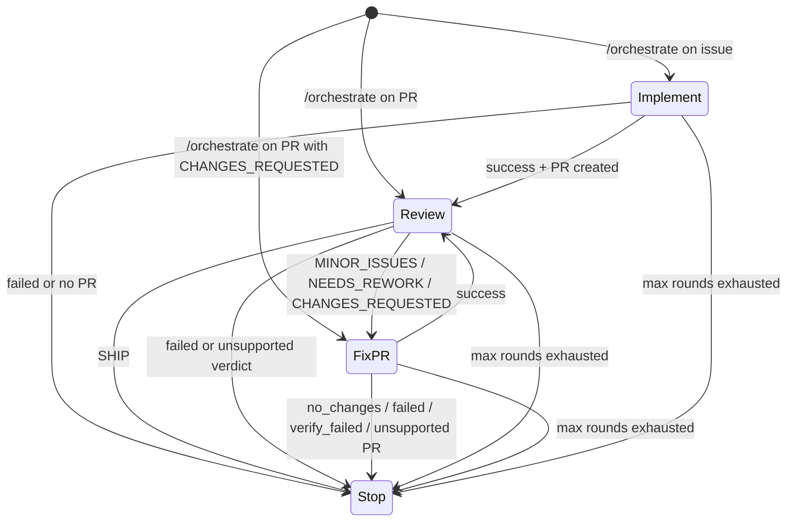

# Agent orchestrator

The orchestrator is an explicit high-level route (`/orchestrate` or `agent/orchestrate`) that evaluates current target state and dispatches the most appropriate built-in next action.

Configure `AGENT_AUTOMATION_MODE` to choose how orchestrator handoffs are decided:

| Mode | Meaning |
|---|---|
| `heuristics` | Deterministic built-in state machine. |
| `agent` | Planner-assisted orchestration, validated by runtime policy. |

Set `AGENT_AUTOMATION_MAX_ROUNDS` to cap the chain length.

## Current heuristics state machine

The orchestrator supports an explicit manual start plus the existing bounded handoff policy:

When the route starts, the router dispatches `agent-orchestrator.yml` with:

- source action (`orchestrate`)
- target kind (`issue` or `pull_request`)
- target number
- requester and request text
- current round and max rounds
- optional `base_branch` or `base_pr` for stacked implementation PRs

Each action workflow launched by `agent-orchestrator.yml` receives
`orchestration_enabled: true`. Only runs with that explicit context hand back to
the orchestrator after post-processing; direct `/implement`, `/review`, and
`/fix-pr` runs keep the default `orchestration_enabled: false` and stop after
their own workflow. For orchestrator-launched fix-pr runs, the completion
status comment attributes the visible request mention to the configured agent
handle (`AGENT_HANDLE`, default `@sepo-agent`) instead of re-tagging the
original human requester.

When an action-originated handoff is used, the orchestrator also accepts:

- source action
- source conclusion
- target issue or pull request number
- next target number when implementation opened a pull request
- source workflow run ID for duplicate-dispatch detection
- current round and max rounds
- requester and request text to carry forward

In `heuristics` mode, manual starts use deterministic status checks:

- issue target: dispatch `implement`
- pull request target with `CHANGES_REQUESTED`: dispatch `fix-pr`
- other open pull request targets: dispatch `review`

In `agent` mode, an issue-level manual start can act as a meta-orchestrator.
The planner may return `delegate_issue`, which is an internal command rather
than a public route. The dispatcher creates or reuses one child issue for the
requested stage and dispatches `agent-orchestrator.yml` for the child issue in
heuristic mode. New agent-created child issues store a hidden
`sepo-sub-orchestrator` marker in the issue body. Existing user-authored issues
can also be adopted when the planner provides `child_issue_number`; adoption
stores the marker in an agent-authored child issue comment instead of editing or
trusting the user-authored body. The child issue then follows the normal bounded
chain of `implement`, `review`, and `fix-pr` runs. The public route remains
`/orchestrate`; the internal command keeps child delegation separate from
concrete follow-up actions such as `implement`, `review`, and `fix-pr`.

When the meta-orchestrator continues sequential child implementation work after
a prior child produced an open, unmerged PR, the planner should set `base_pr` to
that prior child PR unless the next child is intentionally independent.

Child issue metadata is intentionally GitHub-visible state, not session state.
The parent issue keeps the meta planner session, while each child issue gets its
own normal issue target identity. When the child reaches a terminal stop, the
handoff dispatcher resolves the trusted child marker from the child issue body or
from agent-authored child issue comments, or through a closing issue reference in
the terminal PR body. It then writes a parent progress comment, dispatches the
parent issue orchestrator in agent mode with the child result, and marks the
same trusted child marker as `done`, `blocked`, or `failed`. The progress
comment includes a hidden resume marker so reruns can recover a pending report
or skip an already-dispatched terminal report.

Initial user-launched `/orchestrate` requests validate that the requester has
access to the delegated route capability set before dispatching work. This keeps
authorization at the user boundary: child and parent resume dispatches preserve
`requested_by` for traceability, but they do not need to thread requester
association and route policy through every downstream workflow.

When an orchestrator dispatches `implement`, it forwards any explicit
`base_branch` or `base_pr` input. `agent-implement.yml` then resolves a single
base branch: `base_branch` is used when set, `base_pr` resolves to the open
same-repository PR head branch, and the repository default branch is used when
neither input is present. Setting both base inputs is rejected.

Manual pull request starts remain deterministic in `agent` mode. Issue-level
manual starts may invoke the planner for `delegate_issue` meta-orchestration,
and action-originated handoff envelopes use the planner path when enabled.

In `heuristics` mode, action-originated handoff decisions still use the fixed transition policy and round budget checks.

In `agent` mode, the orchestrator first runs a scoped planner prompt through the same resolved-provider runtime used by other agent actions. The planner has its own `orchestrator` route and `planner` lane, so session continuation is separate from implement, review, and fix-pr sessions. The planner runs with `approve-all` tool permission so it can gather current GitHub and repository context in non-interactive workflows. It still receives read-only repository memory, selected read-only rubrics, the handoff envelope, and original request, and returns JSON describing whether to stop, block, delegate a child issue, or hand off. For handoffs, the planner may also return `handoff_context`: explicit, action-oriented instructions for the next workflow. When the next action is `fix-pr`, the dispatcher passes that context into `agent-fix-pr.yml`, and the fix-pr prompt treats it as initial steering for the automated fix pass. The workflow uses the runtime preflight CLI to skip this planner when the max-round budget is already exhausted or the initial requester lacks delegated-route capability, and the runtime still validates planner JSON against the fixed transition policy and max-round budget before dispatching anything.

When an orchestrator-launched `implement` or `fix-pr` run reports
`no_changes`, `failed`, `verify_failed`, or `unsupported`, the dispatcher stops
and posts a structured stop comment on the current target with the source
action, conclusion, target, round, reason, and source run ID. For `fix-pr`, the
runtime does not re-review automatically after those conclusions; `fix-pr` must
succeed before the chain can hand back to `review`.

Before dispatching, the orchestrator checks for a hidden handoff marker on the destination issue or pull request. It then writes a `pending` marker for the current source run, source action, destination action, target, and round, dispatches the next workflow, and updates the marker to `dispatched` after `workflow_dispatch` succeeds. After a successful dispatch, it minimizes older visible handoff marker comments from the same authenticated agent account as outdated unless `AGENT_COLLAPSE_OLD_REVIEWS=false` is set. If dispatch fails, the marker is updated to `failed` so a rerun can retry. Rerunning the same source action or orchestrator run skips fresh `pending` or `dispatched` markers instead of enqueueing a duplicate next action. A `pending` marker records its creation time; if it is older than the one-hour stale threshold, the orchestrator marks it `failed` and retries so cancelled runs do not permanently block handoff. Non-success statuses and unsupported verdicts stop the chain.

## Permission note

`agent-orchestrator.yml` requests `actions: write` because `workflow_dispatch` requires it, and `issues: write` to persist dedupe markers on destination issues or pull requests.

## Extension path

The orchestration boundary is deliberately small: richer agent planning can expand behind the same explicit route while keeping budget checks, dedupe markers, and dispatch validation in runtime code. Runtime policy should continue to enforce allowed transitions and max rounds even when a planner suggests the next action.
