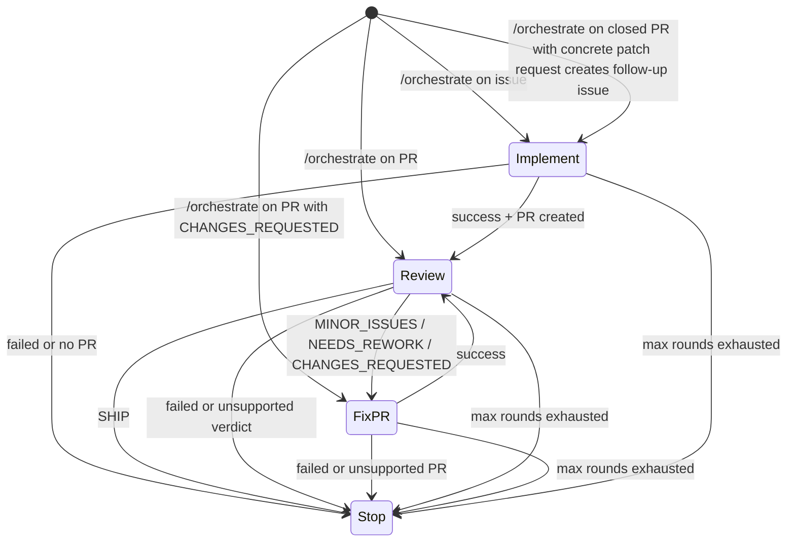

# Agent orchestrator

The orchestrator is an explicit high-level route (`/orchestrate` or `agent/orchestrate`) that evaluates current target state and dispatches the most appropriate built-in next action.

Configure `AGENT_AUTOMATION_MODE` to choose how orchestrator handoffs are decided:

| Mode | Meaning |
|---|---|
| `heuristics` | Deterministic built-in state machine. |
| `agent` | Planner-assisted orchestration, validated by runtime policy. |

Set `AGENT_AUTOMATION_MAX_ROUNDS` to cap the chain length.

## Current heuristics state machine

The orchestrator supports an explicit manual start plus the existing bounded handoff policy:

When the route starts, the router dispatches `agent-orchestrator.yml` with:

- source action (`orchestrate`)
- target kind (`issue` or `pull_request`)
- target number
- requester and request text
- source comment URL when available
- current round and max rounds

Each action workflow launched by `agent-orchestrator.yml` receives
`orchestration_enabled: true`. Only runs with that explicit context hand back to
the orchestrator after post-processing; direct `/implement`, `/review`, and
`/fix-pr` runs keep the default `orchestration_enabled: false` and stop after
their own workflow.

When an action-originated handoff is used, the orchestrator also accepts:

- source action
- source conclusion
- target issue or pull request number
- next target number when implementation opened a pull request
- source workflow run ID for duplicate-dispatch detection
- current round and max rounds
- requester and request text to carry forward

In `heuristics` mode, manual starts use deterministic status checks:

- issue target: dispatch `implement`
- pull request target with `CHANGES_REQUESTED`: dispatch `fix-pr`
- other open pull request targets: dispatch `review`
- closed or merged pull request target with a concrete patch/fix request: create a
  follow-up issue linked to the source PR/comment, comment on the source PR, and
  dispatch `implement` against the new issue
- closed or merged pull request target without a concrete code-change request:
  stop with a visible explanation on the source PR

Manual `/orchestrate` starts are deterministic in `agent` mode as well. Planner
runs are reserved for action-originated handoff envelopes.

In `heuristics` mode, action-originated handoff decisions still use the fixed transition policy and round budget checks.

In `agent` mode, the orchestrator first runs a scoped planner prompt through the same resolved-provider runtime used by other agent actions. The planner has its own `orchestrator` route and `planner` lane, so session continuation is separate from implement, review, and fix-pr sessions. The planner receives the handoff envelope, read-only repository memory, selected read-only rubrics, and original request, and returns JSON describing whether to stop, block, or hand off. For handoffs, the planner may also return `handoff_context`: explicit, action-oriented instructions for the next workflow. When the next action is `fix-pr`, the dispatcher passes that context into `agent-fix-pr.yml`, and the fix-pr prompt treats it as initial steering for the automated fix pass. The workflow uses the runtime preflight CLI to skip this planner when the max-round budget is already exhausted, and the runtime still validates planner JSON against the fixed transition policy and max-round budget before dispatching anything.

Before dispatching, the orchestrator checks for a hidden handoff marker on the destination issue or pull request. It then writes a `pending` marker for the current source run, source action, destination action, target, and round, dispatches the next workflow, and updates the marker to `dispatched` after `workflow_dispatch` succeeds. If dispatch fails, the marker is updated to `failed` so a rerun can retry. Rerunning the same source action or orchestrator run skips fresh `pending` or `dispatched` markers instead of enqueueing a duplicate next action. A `pending` marker records its creation time; if it is older than the one-hour stale threshold, the orchestrator marks it `failed` and retries so cancelled runs do not permanently block handoff. Non-success statuses and unsupported verdicts stop the chain.

## Permission note

`agent-orchestrator.yml` requests `actions: write` because `workflow_dispatch` requires it, and `issues: write` to persist dedupe markers on destination issues or pull requests.

## Extension path

The orchestration boundary is deliberately small: richer agent planning can expand behind the same explicit route while keeping budget checks, dedupe markers, and dispatch validation in runtime code. Runtime policy should continue to enforce allowed transitions and max rounds even when a planner suggests the next action.
