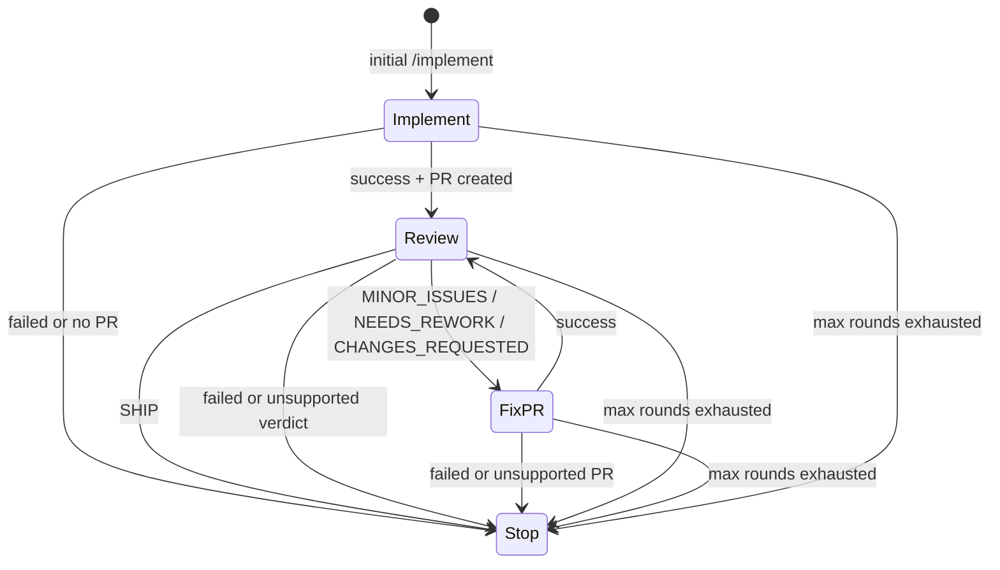

# Agent orchestrator

The action handoff orchestrator is a post-action workflow for automation mode. It gives completed agent actions a separate place to hand back control before any next built-in action is dispatched.

Automation is disabled by default. Configure `AGENT_AUTOMATION_MODE` as a mode value:

| Mode | Meaning |
|---|---|
| `disabled` | Default. Source actions do not call the orchestrator. |
| `heuristics` | Built-in state machine mode. |
| `agent` | Runs an agent planner, then validates the planner's decision against the same built-in policy, budget, and dedupe rules. |

For compatibility with early boolean-style configuration, `true` is treated as `heuristics` and `false` is treated as `disabled`. Use `heuristics` as the only named spelling for the built-in state machine. Set `AGENT_AUTOMATION_MAX_ROUNDS` to cap the chain length.

## Current heuristics state machine

The first implementation intentionally supports only the common built-in loop:

Each action workflow passes a tiny handoff payload to `agent-orchestrator.yml`:

- source action
- source conclusion
- target issue or pull request number
- next target number when implementation opened a pull request
- source workflow run ID for duplicate-dispatch detection
- current round and max rounds
- requester and request text to carry forward

The source actions do not own orchestration policy. They only carry this envelope forward so the orchestrator can make the post-action decision after the action completes.

In `heuristics` mode, the orchestrator workflow validates automation mode and the round budget, chooses the next action from the fixed state machine, and dispatches the route-specific workflow with `workflow_dispatch`.

In `agent` mode, the orchestrator first runs a scoped planner prompt through the same resolved-provider runtime used by other agent actions. The planner has its own `orchestrator` route and `planner` lane, so session continuation is separate from implement, review, and fix-pr sessions. The planner receives the handoff envelope, read-only repository memory, selected read-only rubrics, and original request, and returns JSON describing whether to stop, block, or hand off. For handoffs, the planner may also return `handoff_context`: explicit, action-oriented instructions for the next workflow. When the next action is `fix-pr`, the dispatcher passes that context into `agent-fix-pr.yml`, and the fix-pr prompt treats it as initial steering for the automated fix pass. The workflow uses the runtime preflight CLI to skip this planner when the max-round budget is already exhausted, and the runtime still validates planner JSON against the fixed transition policy and max-round budget before dispatching anything.

Before dispatching, the orchestrator checks for a hidden handoff marker on the destination issue or pull request. It then writes a `pending` marker for the current source run, source action, destination action, target, and round, dispatches the next workflow, and updates the marker to `dispatched` after `workflow_dispatch` succeeds. If dispatch fails, the marker is updated to `failed` so a rerun can retry. Rerunning the same source action or orchestrator run skips fresh `pending` or `dispatched` markers instead of enqueueing a duplicate next action. A `pending` marker records its creation time; if it is older than the one-hour stale threshold, the orchestrator marks it `failed` and retries so cancelled runs do not permanently block handoff. Non-success statuses and unsupported verdicts stop the chain.

## Permission note

The source action workflows and `agent-orchestrator.yml` request `actions: write` because `workflow_dispatch` requires it. GitHub Actions permissions are static, so that permission is present even when `AGENT_AUTOMATION_MODE=disabled`. Automation remains disabled by default; repositories that enable it accept this wider workflow permission footprint for dispatch-capable runs. The orchestrator also needs `issues: write` to persist dedupe markers on destination issues or pull requests.

## Extension path

The orchestration boundary is deliberately small: richer agent planning can expand behind the same post-action hook while keeping budget checks, dedupe markers, and dispatch validation in runtime code. Runtime policy should continue to enforce allowed transitions and max rounds even when a planner suggests the next action.
