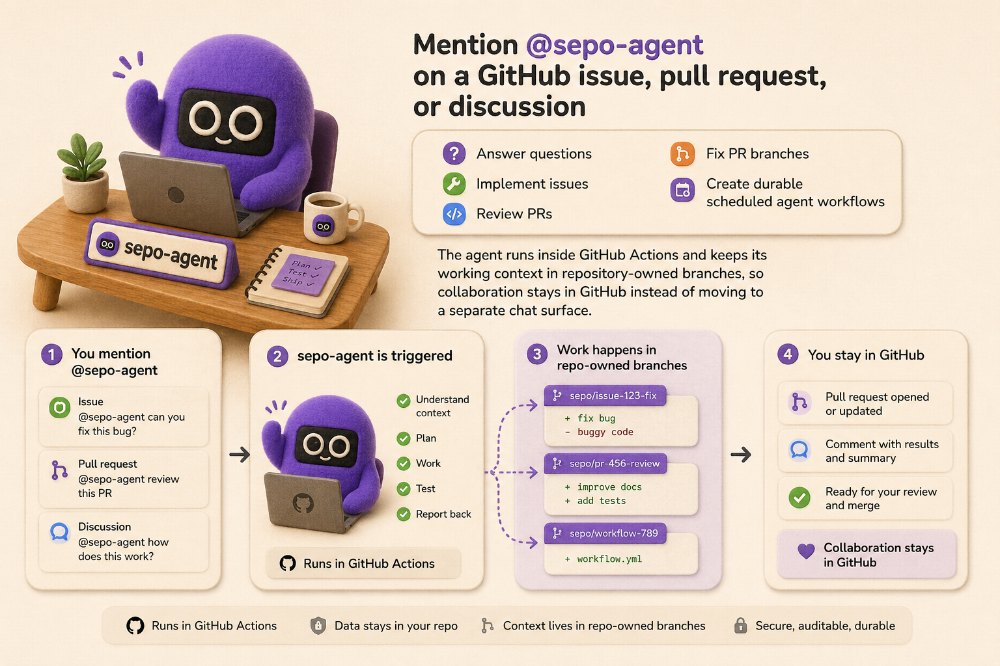

# sepo: self-evolving repository

Mention `@sepo-agent` on a GitHub issue, pull request, or discussion to answer questions, implement issues, review PRs, fix PR branches, or create durable scheduled agent workflows. Sepo runs inside GitHub Actions and keeps working context in repository-owned branches, so collaboration stays in GitHub instead of moving to a separate chat surface.

Sepo turns a repository into a **self-evolving repository**: a codebase that can react to user requests, preserve agent-facing memory and user/team rubrics, and improve both application code and its own automation over time. For the concept behind that architecture, see [What is a self-evolving repository?](.agent/docs/overview/what-is-self-evolving-repo.md).



## Quick Start

### Start from this template

1. Fork this repository or use it as a template.
2. Install the [Sepo GitHub App](https://github.com/apps/sepo-agent-app/installations/select_target) and ensure GitHub Actions is enabled for your repository.
   - Alternatively, you can use [your own GitHub App](.agent/docs/deployment/using-your-own-github-app.md) when you want a self-managed app identity.
   - See the [setup guide](.agent/docs/deployment/setup-guide.md) for all auth options and trade-offs.
3. Add at least one model-provider credential as a repository secret:
   - `OPENAI_API_KEY` for Codex-backed runs.
   - `CLAUDE_CODE_OAUTH_TOKEN` for Claude-backed runs.
4. Open an issue and mention `@sepo-agent` in the issue body or a comment. After a short delay, the workflow should add an eyes reaction and then post a response.

### Install into an existing repository

Check [Install into an existing repository](.agent/docs/deployment/install-existing-repository.md) for the detailed guide. TL;DR: you (or your agent) should copy `.agent/` and `.github/`, configure secrets, and initialize agent memory from GitHub Actions.

## What You Can Ask It To Do

### In any GitHub text input (issues, PRs, discussions), call the agent to execute tasks

```python
# Use a free-form mention when you want the router to infer the best route:
@sepo-agent can you explain how review synthesis works?

# Use an explicit slash route when you already know the action
@sepo-agent /implement implement issue #2

# Invoke arbitrary skills
@sepo-agent /skill <skill-name>

# Inside a PR
@sepo-agent /review
@sepo-agent /fix-pr
```

> [!WARNING]
> Only authorized repository users can trigger Sepo. By default, repositories allow `OWNER`, `MEMBER`, `COLLABORATOR`, and `CONTRIBUTOR` associations; public repositories can tighten this with `AGENT_ACCESS_POLICY`. See [Trigger access policy](.agent/docs/access-policy.md) to customize that behavior.


### You can also trigger the same built-in routes by adding `agent/*` labels to PRs

For example, adding the `agent/review` label will run the review agent.

### Automatic Task Orchestration Layer
When automation mode is enabled, Sepo can chain follow-up actions after an initial run, such as review after implementation and fix after review. The orchestrator applies deterministic guardrails like dedupe checks and max-round limits to keep loops bounded.

### Tracking Workspace Memory and Rubrics
Sepo persists long-lived context in `agent/memory` and preference rules in `agent/rubrics`, both as repository-owned branches. This lets later runs resume with durable project context and team-specific guidance.

### Scheduled Jobs
You can run Sepo on a schedule to handle recurring maintenance, triage, or monitoring tasks without a manual mention. For example, [`agent-daily-summary.yml`](.github/workflows/agent-daily-summary.yml) can publish a daily repository activity summary discussion. Scheduled workflows still route through the same policy and memory layers, so they behave consistently with on-demand runs.


## How It Works

Every trigger converges on `agent-router.yml`, which extracts GitHub context, applies access policy, optionally triages free-form requests with a model, and dispatches to a specialized route. Agent sessions are persisted across runs with git refs and GitHub Actions artifacts, so a later mention can continue from prior context.

Durable context lives in two repository-owned branches:

- `agent/memory` mirrors GitHub artifacts and stores curated project context.
- `agent/rubrics` stores user/team preferences that guide implementation and review.

When automation mode is enabled, completed actions can hand back to `agent-orchestrator.yml`, a deterministic post-action boundary that manages follow-up review and fix loops with dedupe and max-round budgeting.

## Learn More

Getting started:

- [Quick start](.agent/docs/overview/quick-start.md)
- [Setup guide](.agent/docs/deployment/setup-guide.md)
- [Install into an existing repository](.agent/docs/deployment/install-existing-repository.md)

Understanding the system:

- [Overall design](.agent/docs/architecture/overall-design.md)
- [Supported workflows](.agent/docs/architecture/supported-workflows.md)
- [Agent actions](.agent/docs/actions/agent-actions.md)

Customizing and operating:

- [Configuration list](.agent/docs/customization/configuration-list.md)
- [Repository memory](.agent/docs/architecture/memory.md)
- [User/team rubrics](.agent/docs/architecture/rubrics.md)

See the [full documentation index](.agent/docs/README.md) for technical details, deployment options, and the complete docs tree.
